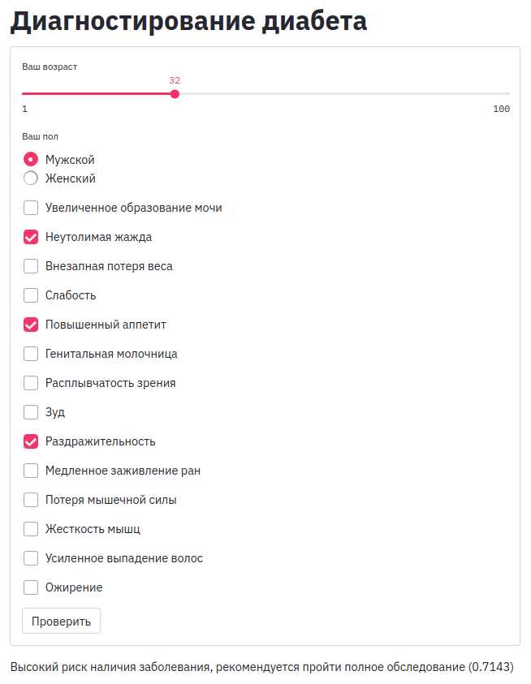

#### virtualenv

```bash
git clone git@github.com:vaaliferov/paranormal.git
git clone https://github.com/vaaliferov/paranormal.git

cd paranormal/diabetes/app
vim diabetes_app.service (<user>)

mkdir /opt/diabetes_app
chown <user> /opt/diabetes_app
chmod 755 /opt/diabetes_app
cp app.py lang_ru.py /opt/diabetes_app
cp model.pkl /opt/diabetes_app
cp diabetes_app.service /etc/systemd/system

apt install python3-venv
pip3 install virtualenv
python3 -m venv /opt/diabetes_app/env
source /opt/diabetes_app/env/bin/activate
pip3 install -r requirements.txt
deactivate

systemctl daemon-reload
systemctl start diabetes_app.service
systemctl status diabetes_app.service
systemctl enable diabetes_app.service
```

#### docker

```bash
git clone git@github.com:vaaliferov/paranormal.git
git clone https://github.com/vaaliferov/paranormal.git

cd paranormal/diabetes/app

docker build -t <user>/diabetes_app .

docker run -p 127.0.0.1:8501:8501/tcp --rm --name diabetes_app <user>/diabetes_app
```

http://diabetes.ipq.co:8501  

  