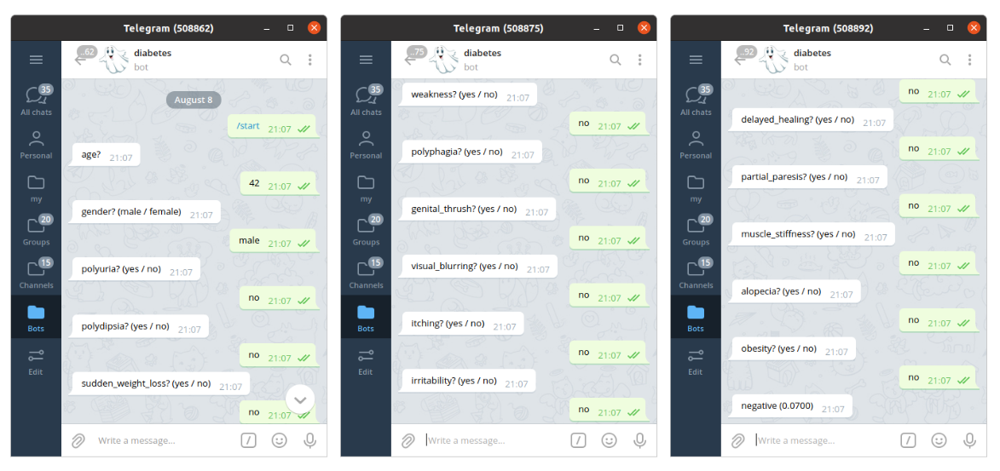

### 1. Выбор проекта

Проект посвящен проблеме раннего диагностирования сахарного диабета.

Важность проекта обусловлена тем, что сахарный диабет – **хроническое и полностью неизлечимое заболевание.**
* Каждые 10 секунд в мире становится на 2 больных сахарным диабетом больше. Это 7 миллионов в год. Каждые 10 секунд 1 человек умирает от связанного с диабетом заболевания. Это 4 миллиона в год.
* Пациенты **могут и не подозревать** о существовании у них сахарного диабета, и в таких случаях диабет выявляется либо при профилактических осмотрах, либо при обследовании другого заболевания, когда уже не будет возможности недопустить его развития или осложнений. 
* Диабет опасен осложнениями. 8 самых грозных из них – инфаркт, инсульт, слепота, заболевания почек, гангрена нижних конечностей (с последующей ампутацией), осложнения беременности и риск здоровья будущего ребёнка, эректильная дисфункция, инфекционные заболевания.
* По статистике, диабет может отнять 10 лет жизни человека.

**Ситуация в мире:**
* На текущий момент именно диабет является тем хроническим заболеванием, **распространенность которого растет в мире.** И если вероятность смерти в возрасте от 30 до 70 лет по причине неинфекционных заболеваний, принадлежащих к одной из четырех основных групп (сердечно-сосудистые, онкологические, хронические заболевания органов дыхания или диабет), снизилась во всем мире на 18% за 2000-2016 гг., то заболеваемость именно от диабета увеличилась на 5% за 2000-2016гг.  
* За период с 1980 по 2014 г. количество людей, страдающих диабетом, выросло со 108 миллионов до 422 миллионов. **Но реальное число заболевших еще выше**, т. к. часто диабет протекает в стертой форме и своевременно не диагностируется, соответственно больные не получают необходимого лечения, что может приводить к инвалидизации больных без должного лечения.

**Ситуация в России:**
* В России предположительная распространенность сахарного диабета составляет 5,7%, а численность больных - 9 миллионов человек.
* По прогнозам, к 2025 году количество больных сахарным диабетом увеличится вдвое, а к 2030 году, по расчетам Международной федерации диабета, с этим диагнозом будет 500 миллионов человек

**Описание проекта**
Мы предлагаем сервис по раннему диагностированию сахарного диабета для растущей сети клиник M, расположенных в городе-миллионнике N.
* Разработана модель раннего диагностирования сахарного диабета с использованием реальных данных 512 пациентов, опубликованных на http://archive.ics.uci.edu/ml/datasets/Early+stage+diabetes+risk+prediction+dataset.#

* Также модель выполняет и просветительскую функцию - информирование населения о проблеме диабета в целом и о тех симптомах, которые возникают при диабете, в частности.

Источники:
* https://www.who.int/ru/news-room/fact-sheets/detail/diabetes
* http://68.rospotrebnadzor.ru/content/545/21700/
* https://minzdrav.gov.ru/news/2019/11/14/12812-vsemirnyy-den-borby-s-diabetom

### 2. Бизнес и математическая постановки задачи

##### Бизнес:

Мы активно развивающаяся сеть клиник M, расположенных в городе-миллионнике N.

14 ноября 2021 года будет проходить Всемирный день борьбы с диабетом (далее – День). Для повышения узнаваемости бренда сети клиник M и привлечения большего числа клиентов, мы предлагаем приурочить ко Дню запуск телеграмм-бота/сайта с тестом для ранней диагностики повышенного риска сахарного диабета для сети клиник M.

По итогам ввода анонимных данных пациентом, возможны **следующие сценарии**:
* **риск выше среднего**, мы предложим
пройти “Диабет check-up” в клинике по скидкой 30% (расширенный анализ крови и консультация эндокринолога);
* **риск ниже среднего**, мы предложим:
сдать кровь на уровень глюкозы в крови бесплатно при условии платной консультации у диетолога, чтобы обсудить оптимальный рацион питания для профилактики диабета и сохранения здоровья в дальнейшем, со скидкой 30%,
или пройти “Диабет check-up” (расширенный анализ крови и консультация эндокринолога) в клинике по скидкой 10%.

**Бизнес-цель:**
* повысить узнаваемость бренда сети клиник М.;
* привлечь не менее 100 новых пациентов в сеть клиник М.

Для измерения результата промо мы введем специальный код скидки и по итогам мы снимем отчетность и посчитаем количество чеков с примененной скидкой с уникальным id клиента сети Клиник.

Затраты на организацию рекламы чат-бота/сайта и оплату сервиса берет на себя PR отдел в рамках проекта повышения узнаваемости бренда сети клиник М. 

##### Математическая:

1. Требуется решить задачу бинарной классификации. Необходимо прогнозировать одну из меток: болен(высокий риск к заболеванию) или не болен(низкий риск к заболеванию) человек, проходящий тестирование.  
Нет горизонта прогнозирования. Вероятностная модель не требуется.  

2. Оптимизируем F_1 - меру. Поскольку решаем задачу, связанную с медициной, то важной метрикой является полнота(recall). Recall будет  равна 1, если возьмём константную модель, а это решение не подходит, тк оно может негативно сказаться на репутации клиники. Поэтому нужно учитывать precision. F_1 - мера отлично подходит в качестве метрики для решения поставленной задачи.

### 3. Выбор набора данных

### 4. Валидация данных и оценка потенциала
Перечисленные в таблице признаки являются симптомами сахарного диабета. 

К симптомам могут также относиться частичный парез (слабость мышц) и покалывания или онемения в конечностях. 

Стоит отметить, что чем выше стадия сахарного диабета, тем заметнее проявление симптомов. 

Указан признак полиурия, но помимо этого возможно также ночное недержание. Можно добавить и такие признаки, как повышеная потливость, быстрая утомляемость, нехватка энергии, сильная усталость и сухость во рту из-за чувства жажды.

На представленных данных можно построить модель. В будущем в данные можно будет добавить указанные выше симптомы.

Признаки не противоречат друг другу, данные соответствуют гипотезе.

[Baseline](baseline.ipynb) модель показывает следующие результаты:

### 5. Оценка экономического эффекта

Для рассчёта экономичекого эффекта используем следующие показатели:
- *N* -  количество людей, прошедших тестирование;
-  - средняя выручка от 1 пользователя, который по тестированию имеет высокий риск к заболеванию;
-  - средняя выручка от 1 пользователя, который по тестированию имеет низкий риск к заболеванию;
-  - вероятность прихода в клинику людей, которым тестирование сообщило о высоком риске к заболеванию;
-  - вероятность прихода в клинику людей, которым тестирование сообщило о низком риске к заболеванию;
- *x* - скидка, предоставляемая всем, кто прошёл тестирование;
- *p* - качество модели(accuracy);
-  - доля людей, которым тестирование сообщило о высоким риске к заболеванию;
- *LOSS* - урон репутации, связанный с плохим качеством модели, в денежном выражнении;
- *С* -  ресурсы, необходимые для поддержки сервиса тестирования.

***Логика оценки***

Компании принесёт выручку (в рамках этой программы-акции) продажа анализов, которая будет продана тем, кто прошёл тестирование. Те, кому тестирование сообщило о высоким риске к заболеванию, предлагают пройти полный анализ за *5000* рублей, тем, кому тестирование сообщило о низком риске к заболеванию, - общий анализ за *2000* рублей. Причём им всем будет предоставлена скидка *25%*. Не все, кто прошёл тест, придут, поэтому ввели дополнительные параметры  и  .

К расходам относятся обепечение прохождения теста(поддержка сервиса)  и возможные репутационные риски, которые могут возникнуть, если модель будет плохо работать. Например, если всем модель предскажет одинаковый результат или здоровому человеку скажет, что у него большой риск болезни и, наоборот, больному покажет небольшой риск. 

*Экономический эффект:* 

Клинику интересует ситуация, когда выручка больше расходов:

Значения приведённых показателей оценили экспертно:

- *N = 10000*;
-  *= 5000* рублей(полный анализ);
-  *= 2000* рублей(общий анализ);
-  = *0.6 (60%)*;
-  = *0.3 (30%)*;
- *x* = *0.25 (25%)*;
- *p* - качество модели(accuracy[0,1]);
- *H = 0.06* * *Percentage*, где  получено по историческим данным. 0.06 используем, так как это доля людей больных диабетом в России;
- *LOSS* = 100000 рублей;
- *С* = 6000 рублей(оплата сервиса).

Оценим, насколько изменится эффект от роста качества модели на 1%:

Оценим, насколько изменится эффект от роста качества модели на 10%:

### https://t.me/paranormal_diabetes_bot
