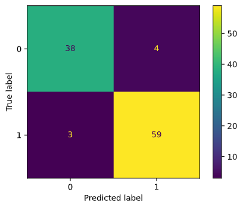

#### 1. Выбор проекта

#### 2. Бизнес и математическая постановки задачи

#### 3. Выбор набора данных

#### 4. Валидация данных и оценка потенциала
Перечисленные в таблице признаки являются симптомами сахарного диабета. 

К симптомам могут также относиться частичный парез (слабость мышц) и покалывания или онемения в конечностях. 

Стоит отметить, что чем выше стадия сахарного диабета, тем заметнее проявление симптомов. 

Указан признак полиурия, но помимо этого возможно также ночное недержание. Можно добавить и такие признаки, как повышеная потливость, быстрая утомляемость, нехватка энергии, сильная усталость и сухость во рту из-за чувства жажды.

На представленных данных можно построить модель. В будущем в данные можно будет добавить указанные выше симптомы.

Признаки не противоречат друг другу, данные соответствуют гипотезе.

[Baseline](baseline.ipynb) модель показывает следующие результаты:

#### 5. Оценка экономического эффекта

#### https://t.me/paranormal_diabetes_bot

