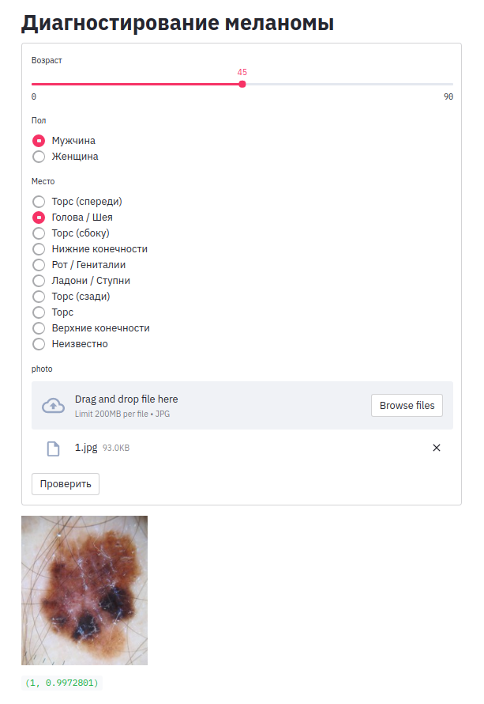

#### virtualenv

```bash
git clone git@github.com:vaaliferov/paranormal.git
git clone https://github.com/vaaliferov/paranormal.git

cd paranormal/melanoma/app
vim melanoma_app.service (<user>)

mkdir /opt/melanoma_app
chown <user> /opt/melanoma_app
chmod 755 /opt/melanoma_app
cp app.py lang_ru.py /opt/melanoma_app
cp model.onnx /opt/melanoma_app
cp melanoma_app.service /etc/systemd/system

apt install python3-venv
pip3 install virtualenv
python3 -m venv /opt/melanoma_app/env
source /opt/melanoma_app/env/bin/activate
pip3 install -r requirements.txt
deactivate

systemctl daemon-reload
systemctl start melanoma_app.service
systemctl status melanoma_app.service
systemctl enable melanoma_app.service
```

#### docker

```bash
git clone git@github.com:vaaliferov/paranormal.git
git clone https://github.com/vaaliferov/paranormal.git

cd paranormal/melanoma/app

docker build -t <user>/melanoma_app .

docker run -p 127.0.0.1:8502:8501/tcp --rm --name melanoma_app <user>/melanoma_app
```

http://melanoma.ipq.co:8502  

  